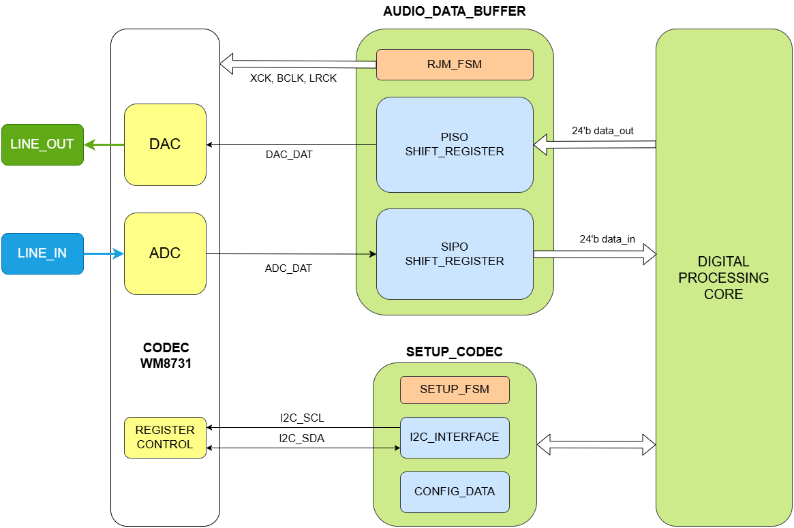
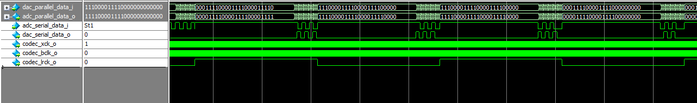
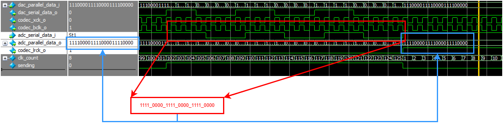
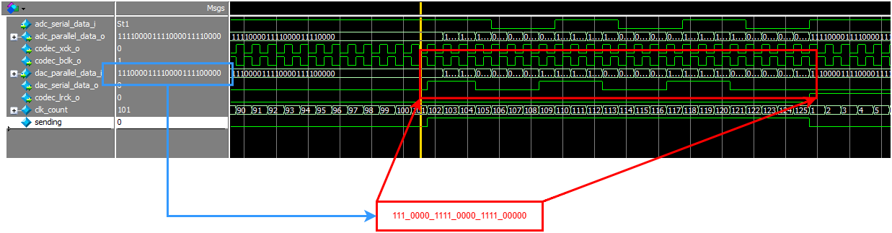

# Audio_Codec_on_DE10_Standard
A simple controller for controlling the Audio Codec WM8731 on DE10-Standard kit.

## Design
### Passive configuration via I2C interface:
- I2C interface:

](doc/pics/2-wire_serial_interface.png)

- Register setup:
 * Configuration Sequence:

](doc/pics/PowerUD_Sequence.png)

 * Register:
    
| Reg  | Data config (hex) | Target 
| ;--- | ;---------------; | ;-----
| R15  | 1E00              | 1
| R6   | 0C10              | 1
| R2   | 0579              | 1
| R3   | 0779              | 1
| R0   | 0017              | 1
| R1   | 0217              | 1
| R4   | 0810              | 1
| R5   | 0A00              | 1
| R7   | 0E08              | 1
| R8   | 1001              | 1
| R9   | 1201              | 1
| R6   | 0C02              | 1

### I/O Digital audio interface:
- Digital audio signals waveform bases on Right Justified Mode audio format:
  
](doc/pics/RJM_audio.png)

- Hardware diagram of digital audio interface:

## Verify
### I2C Interface controller:
- Waveform of I2C_INTERFACE_CONTROLLER:

### Audio data buffer:
- Waveform of signals based on RJM-format:

  * Serial to Paralel: 1-bit ADCDAT to 24-bit SAMPLE_FROM_LINE_IN
    

  * Paralel to Serial: 24-bit SAMPLE_TO_LINE_OUT to 1-bit DACDAT

## Implementation on DE10-Standard kit:

